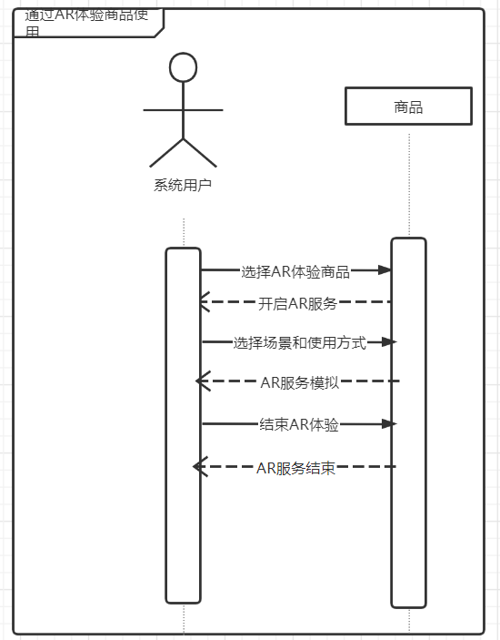

# 需求规格说明

说明：由于本小组前成员蒋立志同学已经退学，所以本次作业是由小组内剩下三人协作完成的。

### 组员信息

| 学号      | 姓名   |
| --------- | ------ |
| 181250047 | 胡子华 |
| 181250106 | 穆奕冰 |
| 181250062 | 金宇航 |

### 度量数值

| 模块         |
| ------------ |
| 业务需求     |
| 用户需求     |
| 系统需求     |
| 系统类图     |
| 顺序图       |
| 状态图       |
| 需求跟踪矩阵 |

## 1. 分析模型

### 1.1 概念类图

系统包含如下类：用户、客服、配送员、商品、评价、订单、物流信息、使用心得、社群、售后、用户列表、商品列表、订单列表、社群列表、使用心得列表。概念类图如下图所示：

系统共有三个角色：用户、客服和配送员。

用户可以搜索或筛选对应的商品列表，查看商品的具体信息，查看商品的评价，如果购买商品，还可以评价商品、享受商品的售后等。用户可以查看自己的订单列表，需要注意的是，同城配送也被作为订单进行处理，用户统一在订单列表里查看。用户可以查看社群列表，并进入感兴趣的社群，里面有若干使用心得供用户查看，用户也可以在社群内自己发表使用心得。

客服响应客户的咨询，和客户进行联系，对商品进行解释、使用指导、售后服务等。

配送员能够查看自己需要配送的订单，并根据配送情况更改配送信息，配送信息是属于订单的。

### 1.2 详细用例说明

对各用例进行面向对象分析建模后结果如下。

#### 1.2.1 搜索商品
##### 1.2.1.1 顺序图
用户搜索商品的顺序图如下图所示：

用户可以根据销量、品牌、好评率等进行筛选
用户搜索时提供联想功能
##### 1.2.1.2 状态图
用户搜索商品的状态图如下图所示：

用户可以条件筛选或者关键词搜索，也可以同时进行

#### 1.2.2 关注其它用户
##### 1.2.2.1 顺序图
关注其它用户的顺序图如下图所示

用户可以关注和取消关注用户
##### 1.2.2.2 状态图
关注其它用户的状态图如下图所示

查看用户信息时，可以查看用户使用心得，使用心得按照访问次数降序排列

#### 1.2.3 浏览商品
##### 1.2.3.1 顺序图
浏览商品的顺序图如下图所示

系统展示商品的具体信息(包括评价和预计送达时间等)
##### 1.2.3.2 状态图
浏览商品的状态图如下图所示

用户可以选择加入购物车

#### 1.2.4 购买商品
##### 1.2.4.1 顺序图
购买商品的顺序图如下图所示

购买成功后，系统生成订单并返回
##### 1.2.4.2 状态图
购买商品的状态图如下图所示

付款失败时，系统提示重新付款

#### 1.2.5 通过AR体验商品使用
##### 1.2.5.1 顺序图
通过AR体验商品使用的顺序图如下图所示

如果用户长时间未响应，系统提示用户并结束AR服务
##### 1.2.5.2 状态图
通过AR体验商品的状态图如下图所示

用户可以选择切换场景和使用方式

#### 1.2.6 评价订单
##### 1.2.6.1 顺序图
评价订单的顺序图如下图所示

评价包含于商品，通过评价订单创建评价
##### 1.2.6.2 状态图
评价订单的状态图如下图所示

用户可以随时取消评价

#### 1.2.7 分享使用心得
##### 1.2.7.1 顺序图
分享使用心得的顺序图如下图所示

用户可以输入文字、图片（可选）、视频（可选）
##### 1.2.7.2 状态图
分享使用心得的状态图如下图所示

用户输入内容超过限制则提示修改输入

#### 1.2.8 同城寄东西
##### 1.2.8.1 顺序图
同城寄东西的顺序图如下图所示

用户可以选择上门取件
##### 1.2.8.2 状态图
同城寄东西的状态图如下图所示

付款失败则提示重新付款

#### 1.2.9 寻求指导使用商品
##### 1.2.9.1 顺序图
寻求指导使用商品的顺序图如下图所示

用户可以选择咨询客服、查找使用心得、报名线下活动
##### 1.2.9.2 状态图
寻求指导使用商品的状态图如下图所示

用户查看心得后可以返回列表继续选择查看

#### 1.2.10 售后咨询
##### 1.2.10.1 顺序图
售后咨询的顺序图如下图所示

用户结束咨询后可以对服务进行评价
##### 1.2.10.2 状态图
售后咨询的状态图如下图所示

如果用户长时间未响应，则自动结束会话

#### 1.2.11 社区交流
##### 1.2.11.1 顺序图
社区交流的顺序图如下图所示

用户可以选择发信息、回信息和发私信
##### 1.2.11.2 状态图

如果被禁言会导致发消息、回消息、发私信失败

#### 1.2.12.1 查看订单物流信息
##### 1.2.12.1 顺序图

订单详情包含物流信息
##### 1.2.12.2 状态图

用户可以选择对我的订单进行条件筛选

### 1.3 OCL语言

- Context User :: searchGoods(content : String): Goods

  Pre: contents.length()>0

- Context User :: focusUsers(user : User): Boolean

  Pre: User.login() =true and user.exist()=true

- Context User :: browseGood(good : Goods): Goods

  Pre: good.exist()=true

- Context User :: buyGood(good : Good): Boolean

  Pre: User.login()=true and good.exist()=true and good.inventory>0

- Context User :: takeAR(good : Good) : ServiceofAR

  Pre: good.ServiceofAR()=true

- Context User :: evalute(text : String, oeder : Order): Boolean

  Pre: User.login()=true and text.length()>0 and oeder.state=completed and oeder.comment=false

- Context User :: needGuide(good : Good): Staff

  Pre: User.login()=true and good.exist()=true

  Post: Staff.chargeGood=good

- Context User :: talkinCommunity(message : Message):Boolean

  Pre: User.login()=true and message.length()>0 

  Post: message.showed=true

- Context User :: chenkLogistics(order : Order): LogisticsView

  Pre: User.login()=true and oeder.state=transporting

  Post: order.LogisticsView=true

## 2.需求跟踪矩阵

### 2.1 需求列表

#### 业务需求

- BR1：第一版系统上线之后的二个月内，用户量有明显的增加。
- BR2：第一版系统上线之后的六个月内，常规交易额明显增加。
- BR3：第一版系统上线之后的六个月内，增值服务交易额明显增加。
- BR4：第一版系统上线之后的两年年内，回头客数量增加。
- BR5：第一版系统上线之后的二个月内，出错率控制在1%以下，故障恢复时间在1个小时内。

#### 用户需求和系统需求

- UR1：搜索商品

- SR1： （1）系统提供用户搜索商品的功能

  ​			（2）用户搜索商品时，系统能快速展示与搜索内容相关的商品列表，而且要按照相关度从上到下排序商品

- UR2：关注其他用户

- SR2：  （1）系统允许用户关注其他用户

  ​			（2）用户关注完另一个用户后，系统要在把这个谁关注了谁的信息存进数据库，并把状态改为已关注。

- UR3：浏览商品

- SR3：  （1）系统提供用户浏览是商品的功能

  ​			（2）用户在浏览商品时，系统能够及时根据用户的滑动进行更新展示界面，当用户点击某一商品的详情时，系统能够跳转到

  ​					  对应商品的详情界面。

- UR4：购买商品

- SR4：  （1）系统提供用户购买商品的功能

  ​			（2）用户购买完商品时，系统要把这条订单信息存进数据库的订单列表中，同时写进该用户的订单列表中。

- UR5：通过AR体验商品使用

- SR5：  （1）系统允许用户使用AR体验某些提供AR体验的商品

  ​			（2）系统在可以提供AR体验的商品详情界面加上AR体验的入口，并且当用户点击后可以挑战到AR体验界面。

- UR6：评价订单

- SR6：  （1）系统允许用户评价完成收获后的订单

  ​			（2）用户评价完后，系统要把评论的内容写进数据库中该订单的评论属性中，并且要及时在对应商品的评论中展示出来。

- UR7：同城寄东西

- SR7：  （1）系统提供同城寄快递的业务，用户可以通过该业务生成寄快递订单来寄东西。

  ​			（2）用户在提交同城寄快递订单后，会有工作人员上门取件然后寄到目的地。系统要能及时通知工作人员上门取件和将订单					  信息写入数据库中的订单列表。

- UR8：寻求指导使用商品

- SR8：  （1）系统提供商品在线指导使用的功能

  ​			（2）用户点击某一商品的在线指导后，系统能快速转接到专门的工作人员与用户连线进行在线商品使用指导。

- UR9： 售后咨询

- SR9：  （1）系统提供订单售后咨询的功能

  ​			（2）用户对所购买的商品有任何售后问题，点击售后咨询按钮后，系统能快速转接工作人员在线解决用户的问题。

- UR10：社群交流

- SR10：  （1）系统提供用户通过社群交流的功能。

  ​			（2）用户进入某一个社群后，系统能把该用户信息写入数据库中该社群的成员列表，然后用户在社群里发消息后，系统要把					  该消息写入数据库中该社群的消息内容列表中，并及时将其显示出来。

- UR11：查看订单物流信息

- SR11：  （1）系统允许用户查看自己的订单的物流信息

  ​			（2）用户点击某一订单的物流跟踪按钮后，系统能快速跳转到该订单对应的实时物流信息显示界面。

### 2.2 需求跟踪矩阵

## 3.软件需求规格说明文档

### 3.1 引言

本文档是对WareMall（万尔）线上APP的需求规格说明，本文档将供用户方和系统开发团队使用。

#### 3.1.1 目的

为明确软件需求、安排项目规划与进度、组织软件开发与测试，撰写本文档。

#### 3.1.2 范围

开发WareMall（万尔）线上APP，用户可以通过这个APP实现网上购物、网上寄东西（同城快递）、社群活动等功能。基于万尔的实体店仓库、快递系统的成熟基础，用户可以通过WareMall（万尔）线上APP得到比目前大多数的在线购物APP更好的体验，而万尔也可以通过线上APP来扩大业务范围。

#### 3.1.3 定义、首字母缩写和缩略语

WM：WareMall（万尔）线上APP

#### 3.1.4 参考文献

需求工程：软件建模与分析，骆斌、丁二玉，高等教育出版社，2009-04-01，ISBN:9787040262957

#### 3.1.5 文档组织

剩下的总体描述部分主要是对WM项目的一些背景和发展前景做介绍，其中包括项目背景、产品前景、产品功能和用户特征；详细需求描述部分主要是对需求做详细的描述，包括对外接口需求、功能需求、性能需求、约束、质量属性和其他需求。

### 3.2 总体描述

#### 3.2.1 项目背景

对于当前同城市场，尽管品类繁多，但很少可以体验到专业服务，质量难以保证，线上购物一般而言到达需要至少一日，而且售后问题难以解决。消息回复滞后，服务态度不好，虚假营销，退款不及时，或者用一系列理由克扣退款金额，诸如此类的售后问题让客户烦恼不已，也是很多客户无法相信线上购物的关键因素。很多用户并不愿意为了一些比较紧急的同城寄件需求亲自跑一趟，如果是工作可能还有应酬的需求，同城寄件日益发展为新时代的新需求。

#### 3.2.2 产品前景

本项目涵盖线下和线上，主打线下，与现有的线下门店相比，该项目的VR体验和生活馆体验可以给用户带来前所未有的产品沉浸式体验，这势必能吸引到线下的顾客。从客户认知产品到最后的产品售后，包括良好的导购服务、在线指导使用和令客户放心的售后服务等等，该项目都立志把服务做到极致，给客户一个完美的体验。这是目前所有的线下店铺或者体验店都做不到的，有着明显的竞争优势。而对于线上而言，该项目也提供VR体验服务，这是目前主流的购物平台还没具备的，而且因为是线下线上相结合的关系，线上购物的配送速度也将是行业超一流水平，同样地，该项目在线上的服务也是要做到极致的，客服、售后等等都要做到行业顶尖水平，给顾客完美的体验。有着线下的基础，线上业务相信也能顺利开展。与此同时，线上还具有别具一格的社群业务，这也令该产品增色不少，也能很好地令用户产生归属感和依赖性。在技术广泛成熟的今天，很多时候产品拼的不是硬实力，而是“服务”二字，该项目的核心价值观就是把服务做到极致，令客户对产品巨大的依赖性，客户使用过一次后便再也离不开。总体而言，该项目的前景是非常可观的。

#### 3.2.3 产品功能

软件的功能主要涵盖以下内容。
FE-1：提供自动推荐用户感兴趣商品的功能
FE-2：提供线上AR技术模拟部分商品实际使用效果的功能FE-3：提供线上下单购买的功能
FE-4：提供同城租赁送快递功能
FE-5：提供社群交流功能
FE-6：提供线上用户分享产品使用心得功能FE-7：提供线上用户关注其他用户功能
FE-8：提供随时查看同城租赁和购买商品配送进度功能
FE-9：提供官方组织相关活动通知用户让用户积极参与的功能
FE-10：提供线上指导如何使用产品功能FE-11：提供线上售后帮助功能
FE-11：提供线上售后帮助功能

#### 3.2.4 用户特征

##### 3.2.4.1 受教育水平

WM面向大众市场，原则上只要对WM的主题商品感兴趣的用户，都能成为目标用户。因此假想的用户的受教育水平并不应该很高，而是处于社会平均水平。

##### 3.2.4.2 经验

软件在尽量提供良好的人机交互界面的基础上，仍然希望用户有一定上网经验、网购经验，具备对各种基本流程的一些理解。

##### 3.2.4.3 技术能力

用户只需要会使用手机即可。

#### 3.2.4 假设和依赖

##### 3.2.4.1 假设

AS-1：线下业务已经取得一定成功
AS-2：线下同城发达配送网络系统已经建设完成AS-3：用户处于随时可以接入互联网的环境
AS-4：用户拥有使用移动APP的功能的能力
AS-5：用户拥有使用电子支付能力如微信支付、支付宝支付、银行卡支付
AS-6：用户只能购买同城内所开展的生活馆里面的产品，不可跨城

##### 3.2.4.2 依赖

DE-1：该APP的服务器依赖于第三方云服务器提供商
DE-2：产品的支付功能需要和第三方支付平台进行集成，可以双向通信和变更
DE-3：产品线上提供可购买的商品依赖于同城仓库的库存管理系统，要实时更新

### 3.3 详细需求描述

#### 3.3.1 对外接口需求

##### 3.3.1.1 用户界面

系统中部分重要界面及需求描述如下。

###### 3.3.1.1.1 首页

用户进入app后显示的页面。
顶部是搜索栏，搜索栏最左边的按钮是筛选条件，右边按钮是定位按钮。
往下留出一个模块给投放的广告。
再往下是瀑布流式商品呈现模块，点击某个商品后，可进入其“商品详情”界面。
最下面的四个按钮，“首页”即当前界面；“寄快递”则跳转到寄快递界面；“社群”即跳转到社群界面；“我的”即跳转到我的界面。（下同）

###### 3.3.1.1.2 寄快递

右上角“添加地址”按钮添加新的寄件地址。
下面的模块以记录的形式显示用户存储的地址，每页最多显示三条，可以滚动翻阅浏览。
再下面的模块第一条是“期望上门时间”，用户选择希望的快递员上门时间；第二条中提供“货到付款”和“提前付款”两个选项供用户选择；最后一栏点击后选择物品类型。
最下面的按钮“我要寄件”点击后完成一次寄件申请。
公司看到用户发出的申请后派遣快递员上门取件。

###### 3.3.1.1.3 商品详情

  

顶部以图片形式提供浏览。
下面提供价格等多项商品信息，并提供“AR体验”按钮供用户点击体验。
页面下方“加入购物车”按钮让用户将商品加入其购物车；“立即购买”则可以进入结算界面，结算完成后生成订单。
     
###### 3.3.1.1.4 社群初始界面

顶部左边显示用户头像及昵称、位置；右端按钮内含四个下级按钮：添加好友、添加群聊、分享心得、反馈，这四个按钮点击以后都能在当前页跳出小窗口进行相应操作。
下面有“我的群聊”“我的关注”“活动通知”三个按钮，分别在页面内的主要模块列表显示对应的内容。
点击某一个群聊后则进入社群群聊界面。

###### 3.3.1.1.5 社群群聊界面

界面与常规软件如微信相似，底部提供输入（文字输入栏、表情包、语音输入按钮、文件输入按钮等）
主要部分则按发布人和内容显示之前的聊天内容。
右上角的“群聊设置”按钮点击后弹出小窗口，内含屏蔽群消息按钮、退群按钮、设置群昵称按钮。

###### 3.3.1.1.6 我的购物车

“我的”界面默认界面。
上面有“我的分享”“购物车”“我的订单”三个按钮，对应在下面模块列表显示对应内容。
中间列表显示购物车内商品，点击某一商品后可跳转到该商品的“商品详情”界面，且每条记录旁边设置“勾选”按钮。
最底端有“全选”按钮，右边依次是“购买”“移入收藏夹”“删除”按钮，对所有被勾选的记录进行相应操作。
购买则进入结算界面。

###### 3.3.1.1.7 我的订单

由“我的”“我的订单”进入的界面。
列表显示每条订单。点击某订单后进入其“订单详情”界面

###### 3.3.1.1.8 订单详情

顶部显示订单状态。
右上角有“删除订单”按钮，可删除此条订单记录在用户界面中的显示。
中间有“申请售后”按钮，点击小窗口显示售后服务界面。
下面显示订单的详细信息。

##### 3.3.1.2 软件接口

使用Mysql作为底层数据库存储数据。

#### 3.3.2 功能需求

##### 3.3.2.1 用户检索商品

###### 3.3.2.1.1 刺激/响应序列

刺激：用户进入首页
响应：系统显示向用户推荐的商品
刺激：用户输入检索文本，并点击搜索
响应：系统显示与用户输入条件重合度高的商品
刺激：用户取消搜索
响应：系统显示之前的商品列表
刺激：用户点击某一商品
响应：系统跳转到商品的商品详情界面

###### 3.3.2.1.2 相关功能需求
|               |       |
| ------------- | ---- |
| Shopping.List | 系统列表显示商品 |
| Shopping.Search | 系统允许用户检索 |
| Shopping.Click | 跳转显示商品详细信息 |

##### 3.3.2.2 用户购买商品      

###### 3.3.2.2.1 刺激/响应序列  

刺激：用户点击购买
响应：系统进入跳转页面
刺激：用户支付成功
响应：系统显示“支付成功”，用户的订单列表添加一条记录
刺激：用户支付失败
响应：系统显示“支付失败”
刺激：用户选择取消交易
响应：系统退出跳转页面
                          
###### 3.3.2.2.2 相关功能需求
|       |     |
| ------- | --- |
| Deal.Pay| 系统允许用户付款|
| Deal.Cancel| 系统允许用户取消交易|
| Deal.OrderAdd | 系统添加用户的订单记录|

##### 3.3.2.3 用户申请售后

###### 3.3.2.3.1 刺激/响应序列

刺激：用户点击订单
响应：系统显示订单详细信息
刺激：用户点击售后按钮
响应：系统显示售后窗口界面
刺激：用户选择投诉反馈
响应：系统显示投诉反馈界面，让用户输入
刺激：用户选择人工客服：
响应：系统转接人工客服与用户连接
刺激：用户关闭临时对话
响应：系统停止连接

###### 3.3.2.3.2 相关功能需求

|       |     |
| ------- | --- |
|AfterMarket.Auto| 系统允许用户自行输入反馈信息 |
|AfterMarket.Connect| 系统允许用户与人工客服连接 |
|AfterMarket.Connect.Cancel| 系统允许用户临时中止对话 |

##### 3.3.2.4 用户参与社群群聊

###### 3.3.2.4.1 刺激/响应序列

刺激：用户进入社群界面
响应：系统列表显示群聊
刺激：用户点击某一个群聊
响应：系统跳转到该群聊天界面，并显示聊天信息
刺激：用户发送一条内容
响应：系统把这条内容加入消息列表并在界面中显示
刺激：用户撤回一条内容
响应：系统把这条内容从消息列表中删除并在界面中不再显示
刺激：用户退出群聊
响应：系统将该用户的群列表中的相应记录删除，并将该群中用户列表中的该条用户记录删除
刺激：用户屏蔽群消息
响应：系统将用户的该群聊状态设置为屏蔽，并不再提示之后发的新消息
刺激：用户取消屏蔽群消息
响应：系统将用户的该群聊状态设置为正常，之后正常提示消息
                        
###### 3.3.2.4.2 相关功能需求

|       |     |
| ------- | --- |
| Group.Send | 系统允许用户发送消息 |
| Group.Recall | 系统允许用户撤回消息 |
| Group.Delete | 系统允许用户删除群聊 |
| Group.Setting | 系统允许用户设置屏蔽 |
| Group.Exit | 系统允许用户退出 |

##### 3.3.2.5 用户查看订单信息

###### 3.3.2.5.1 刺激/响应序列

刺激：用户点击一个订单
响应：系统进入订单详细信息界面
刺激：用户点击查看物流信息
响应：系统显示实时物流信息
                        
###### 3.3.2.5.2 相关功能需求

|       |     |
| ------- | --- |
| Order | 系统允许用户查看订单信息 |
| Order.Logistics | 系统允许用户查看订单物流信息 |

##### 3.3.2.6 用户寄快递 

###### 3.3.2.6.1 刺激/响应序列

刺激：用户点击寄快递
响应：系统进入寄快递界面
刺激：用户添加新地址
响应：系统弹出添加地址界面
刺激：用户删除原地址
响应：系统提示删除成功
刺激：用户点击选择一个地址
响应：系统提示选择成功
刺激：用户点击选择付款方式
响应：系统在界面中的小圆圈内用点标记
刺激：用户点击我要寄件
响应：系统显示“正在派送派件员”，并在寄快递列表生成一条记录，提示管理员查看。
                        
###### 3.3.2.6.2 相关功能需求

|       |     |
| ------- | --- |
| Express.Send | 系统允许用户提交寄快递申请 |
| Express.Setting | 系统允许用户设置快递的各种选项 |
| Express.Address.Add | 系统允许用户添加地址 |
| Express.Address.Delete | 系统允许用户删除地址 |

##### 3.3.2.7 用户评价订单

###### 3.3.2.7.1 刺激/响应序列

刺激：用户点击订单
响应：系统显示订单详情
刺激：用户点击评价
响应：系统显示详情评价界面
刺激：用户点击发布
响应：系统将该评价记录加入数据库中该商品的评价列表中，并在商品评价中可显示；提示用户“评价成功”
                        
###### 3.3.2.7.2 相关功能需求

|       |     |
| ------- | --- |
| Order.Comment | 系统允许用户发布评价 |

##### 3.3.2.8 用户关注其他用户

###### 3.3.2.8.1 刺激/响应序列

刺激：用户点击其他用户头像
响应：系统进入其他用户主页
刺激：用户点击“关注TA”按钮
响应：系统将该用户记录加入用户的关注列表中并将该按钮更改为“取消关注”
刺激：用户点击“取消关注”按钮
响应：系统将该用户记录从用户的关注列表中删除，并将该按钮更改为“关注TA”
                        
###### 3.3.2.8.2 相关功能需求 

|       |     |
| ------- | --- |
| User.Attention | 系统允许用户关注其他用户 |
| User.Attention.Cancel | 系统允许用户取消关注 |

#### 3.3.3 性能需求

##### 3.3.3.1 安全性需求

Safety1: 用户的位置信息只有用户本人有查看权限
Safety2：用户的订单数据应加密存储

##### 3.3.3.2 数据需求

DR1： 购买记录的存储要保持3年以上
DR2:  社群聊天消息记录的存储要保持3个月以上
DR3： 购物车记录要保持1个月以上

#### 3.3.4 约束

IC1: 系统在网络上分布为一个服务器和多个客户端
IC2: 系统采用java语言开发
IC3: 系统开发时长在60天之内

#### 3.3.5 其他需求
系统至少支持iOS、Android操作系统的客户端

